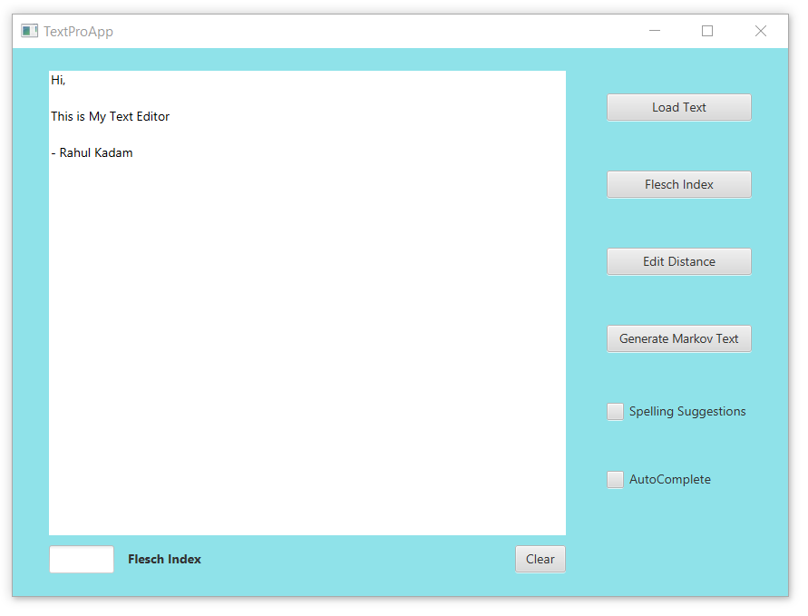
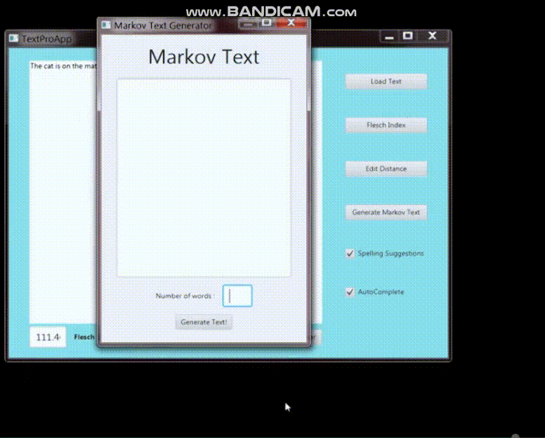

# TextEditor

## Text Editor Application in java

### Features:
1. Spelling Check, Spelling Suggest, Autocomplete 
2. Calculate Flesch Index
3. Edit Distance 
4. Generate Markov Text

### Demo Image:

### Demo Videos:

#### Spelling Check, Spelling Suggest, Autocomplete:

#### Calculate Flesch Index and Edit Distance :

#### Generate Markov Text :

